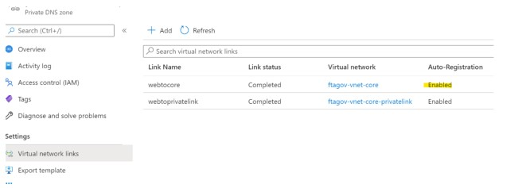
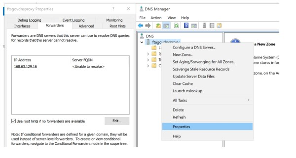
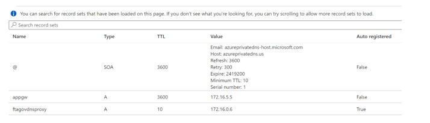
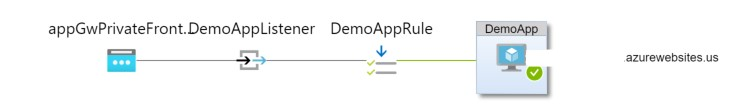

# Networking-DNSForwarder

## Scenario

You would like to access the **Private Link** resources from on-premises without on-premise DNS configuration and using CNAME. 


There are two solution:

**Private Link** - DNS lookup will default to the public endpoint IP address when a query is not originated from within the VNet. [See Docs](https://docs.microsoft.com/en-us/azure/storage/files/storage-files-networking-dns#configuring-dns-forwarding) For Private Link resources, they require an on-premises DNS server with a conditional forwarder configured to the private IP address of the Azure DNS. For environments that require a CNAME record, this IP-Based solution is not applicable. 

<br />

**Private IP** - Queries must originate from the Virtual Network to Azure DNS to resolve to a private endpoint. [See Docs](https://docs.microsoft.com/en-us/azure/private-link/private-endpoint-dns#on-premises-workloads-using-a-dns-forwarder). To serve on-premises requests, a DNS forwarder in Azure is required to resolve the FQDN to a private IP. 

<br />

The first solution requires on-premise DNS configuration and the second solution requires an A record. Neither will work in this case. Below are the steps to a third solution. 

<br />

## **Environment Overview**
- VNET(s) with one subnet specifically for App Gateway, 1 subnet for private endpoints, 1 Gateway subnet, and subnets for other resources.
- VPN Gateway
- App Gateway, VM for DNS Forwarder, Privatelink.*  and mycompay.com Private DNS Zones [Private Link DNS Zones](https://docs.microsoft.com/en-us/azure/private-link/private-endpoint-dns#azure-services-dns-zone-configuration). 

<br/>

## mycompany.com Private DNS Zone configuration:
- Linked to Vnet(s). 
- **"Virtual network links"** are Auto-Registration. 



### DNS Forwarder
Create Windows Server VM for DNS Forwarder in the VNET with the mycompany.com Private DNS Zone. **Optional**: There is also a [Linux solution](https://github.com/Azure/azure-quickstart-templates/tree/master/demos/dns-forwarder). The Private IP will automatically register as an A Record in Private DNS Zone when setting the Auto-Registration when linking to the VNet. 

**VM Configuration**:
- Log into Windows VM and execute command. This can also be installed by custom script extension. 
```	
    Install-WindowsFeature -Name DNS -IncludeManagementTools
```
- Navigate to the DNS Manager -> Right Click Name -> Properties and add Azure Private DNS IP address.




- Add DNS Forwarder private IP to DNS servers to the VNet(s).  


- Restart all servers and download a new VPN device. 

### On-Prem Machine
- **Clear-DnsClientCache** or **ipconfig /flushdns**
- **Resolve-DnsName** -**Name** ftagovdnsproxy.mycompany.com

This should resolve to the private IP address. 

### Access to Private Link Resources

Deploy the App Gateway in the VNet. Add an A Record in the private DNS Zone. e.g. appgw.mycompany.com




Set App Gateway to point to your App Service for the backend. The App Gateway backend is the FQDN of the App Service, which is the Private Endpoint.  The configuration below is port 80 for the Frontend Listener, which has the rule to the port 443 backend for the App Service. 




## Resources

[Q&A Azure Private DNS Zone - Child Zone from On-Prem DNS resolution](https://docs.microsoft.com/en-us/answers/questions/[Azure Private Endpoint DNS configuration](474171/azure-private-dns-zone-child-zone-from-on-prem-dns.html) <br/>
https://docs.microsoft.com/en-us/azure/private-link/private-endpoint-dns) <br/>
